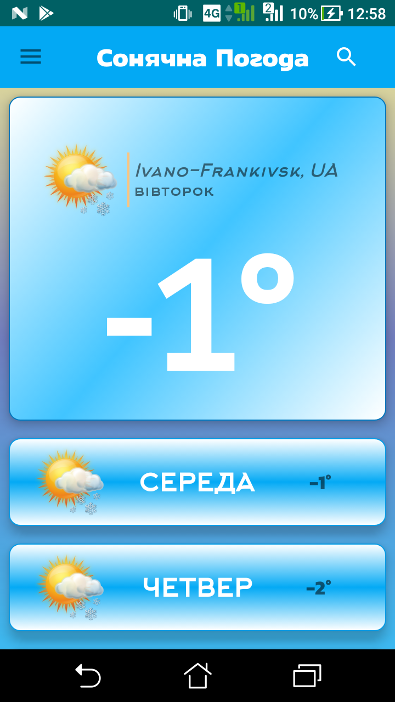
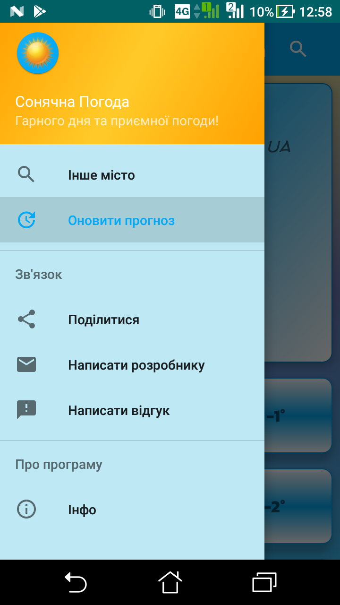
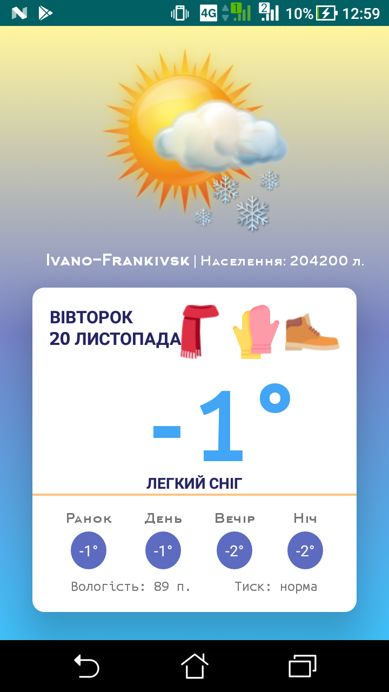
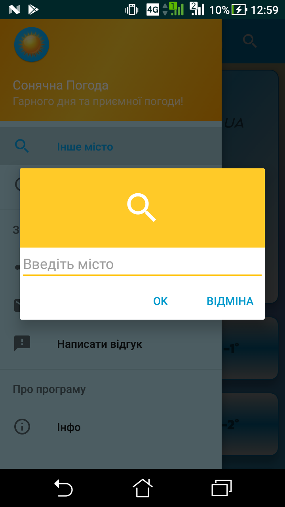

# Weather-App

Technologies, elements and libraries used when writing an application:
Java, Android SDK, HttpConnection, GPS Navigation, AsycTask, JSON Parsing, SQLite Database(Room library), ButterKnife.
This app for knowing weather

## View
<table align="left" width="100%">
  <tbody>
    <tr>
      <td colspan="1">  </td>
      <td colspan="1">  </td>
      <td colspan="1">  </td>
      <td colspan="1">  </td>
      <td colspan="1">  </td>
  </tbody>
</table>

## Version
0.01
## Built With
* Android Studio
* Java

## How to install
Check available apk file into [realises](https://github.com/parnekov/Weather-App/releases).

If it isn't contain necessary files that you need you can just install using the next steps:

1. Install [android studio](https://developer.android.com/studio/)
2. Clone or download project from [github](https://github.com/parnekov/Weather-App/)
3. Run app from android studio -> install on phone
